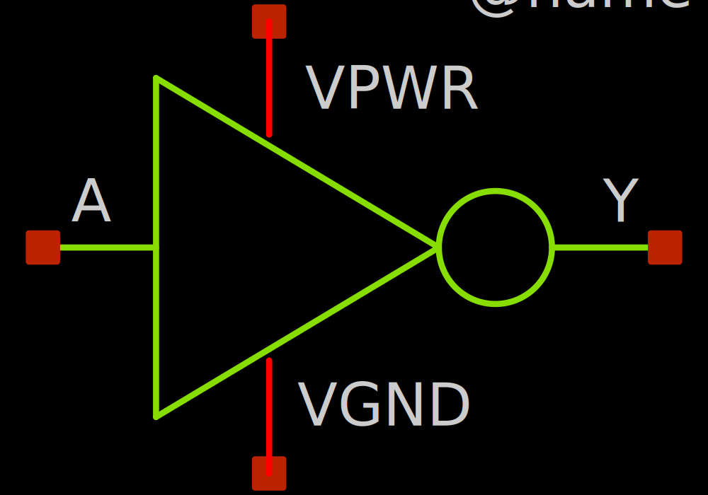
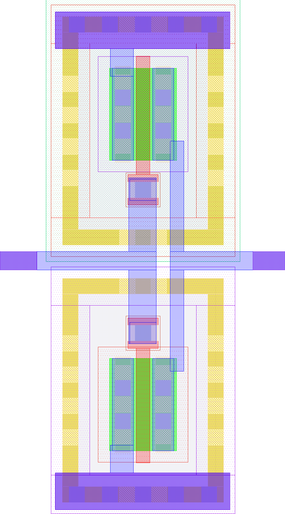
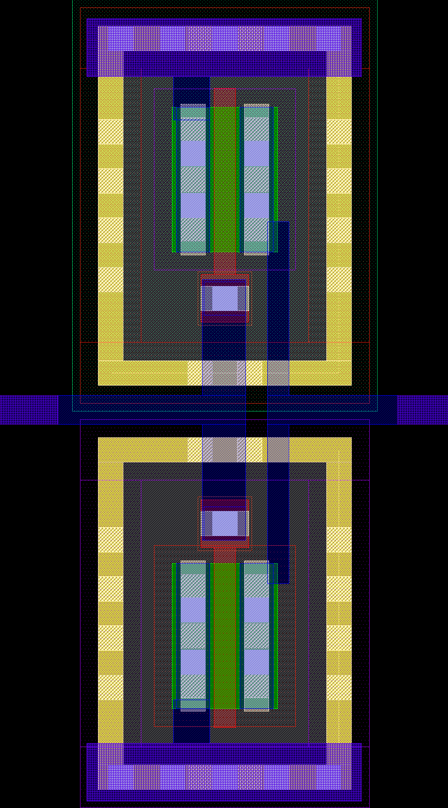

# sky130_ef_ip__template

- Description: A template repository for analog designs to ensure consistency and interoperability between IP blocks.
- PDK: sky130A

## Authorship

- Designer: Leo Moser
- Company: Efabless
- Created: November 20, 2024
- License: Apache 2.0
- Last modified: None

## Pins

- VPWR
  + Description: Digital power supply
  + Type: power
  + Direction: inout
  + Vmin: 1.7
  + Vmax: 1.9
- VGND
  + Description: Digital ground
  + Type: ground
  + Direction: inout
- A
  + Description: Inverter input
  + Type: signal
  + Direction: input
- Y
  + Description: Inverter output
  + Type: signal
  + Direction: output

## Default Conditions

- vdd
  + Description: Power supply voltage
  + Display: Vdd
  + Unit: V
  + Typical: 1.8
- corner
  + Description: Process corner
  + Display: Corner
  + Typical: tt
- temperature
  + Description: Ambient temperature
  + Display: Temp
  + Unit: °C
  + Typical: 27

## Symbol

## Schematic

## Layout

